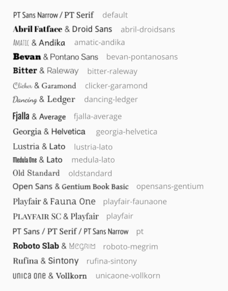

# PWEB: cronología

Para crear tu propia cronología, necesitarás:

## Ingredientes

- [Una cuenta de GitHub](https://github.com/join)
- Un editor de texto plano. Puedes usar [Sublime Text](https://www.sublimetext.com/) o [Atom](https://atom.io/) (ambos son gratuitos)
- Un editor de hojas de cálculo (como [LibreOffice](https://www.libreoffice.org/) Calc &mdash; en lugar de Microsoft Excel, mucho menos conveniente para lo que necesitamos)
- El archivo [grupo0.zip](../../raw/main/grupo0.zip). 

## Instrucciones

1. Extrae el archivo `grupo0.zip` en tu ordenador y renombra la carpeta `grupo0` para que contenga vuestro número de grupo.
2. Abre el archivo `index.html` de esa carpeta con un editor de texto plano (Sublime Text o Atom), y sigue las siguientes instrucciones: 
    - Escribe el título de tu cronología en la etiqueta `<title>`, en la línea 7
    - Escoge la combinación de fuentes tipográficas que quieres usar y cambia `default` al nombre correspondiente, en la línea 18  
      
    - Guarda los cambios cuando hayas acabado
3. Sube la carpeta completa al [directorio `docs` en el repositorio GitHub](/docs): solo arrastra la carpeta desde tu explorador de archivos a la ventana del navegador. Escribe un mensaje de confirmación \(_commit_\) descriptivo (como "Primera versión del directorio grupo0", con tu número de grupo en vez de 0, por ejemplo). Asegúrate de que  está seleccionado, y haz clic en "Commit changes".
    - Ahora tu cronología, aunque vacía, está subida y accesible en línea a través de `https://deustokom.github.io/PWEB21-cronologia/grupo0/` (cambia `0` por tu número de grupo o `group0` por el nombre de tu carpeta).
4. Puedes crear tu propia cronología editando el archivo `timeline-data.csv` en tu editor de hojas de cálculo (preferiblemente LibreOffice Calc):
    - Abre el archivo, y asegúrate de especificar la codificación de caracteres a `UTF-8`. 
    - AAñade una líena por cada evento que quieras mostrar en tu cronología. Para más información, puedes consultar:
        + La cronología de muestra [women in computing](https://deustokom.github.io/PWEB21-cronologia/women-computing/), donde puedes ver los diferentes tipos de contenidos en acción
        + Una descripción de lo que debería ir en cada columna en ["Making a timeline from a spreadsheet"](https://timeline.knightlab.com/docs/using-spreadsheets.html), en el sitio web oficial de la librería TimelineJS 
        + Una lista de los diferentes [tipos de medios](https://timeline.knightlab.com/docs/media-types.html) que puedes usar en la columna `media`  
    - Guarda el archivo, asegurándote de que lo haces en formato `.csv`
6. Sube el archivo a GitHub arrastrándoloe: abre la carpeta correspondiente en tu navegador y arrastra el archivo csv desde tu explorador de archivos; escribe un mensaje de confirmación \(_commit_\) descriptivo (como "Imágenes añadidas a algunos eventos"), comprueba que  está seleccionado y haz clic en "Commit changes". 
7. Incrusta tu cronología en la página del sitio web de vuestro proyecto correspondiente usando este código (reemplaza `grupo0` con el nombre de vuestra carpeta):  
   `<iframe src="https://deustokom.github.io/PWEB21-cronologia/grupo0/" style="width:100%;min-width:920px;min-height:600px;" frameborder="0"></iframe>`

<!-- You will find video versions of these instructions in ALUD. -->

---

Basado en [heoinfo/timelinejs-local](https://github.com/heoinfo/timelinejs-local) y [NUKnightLab/TimelineJS3](https://timeline.knightlab.com/).
